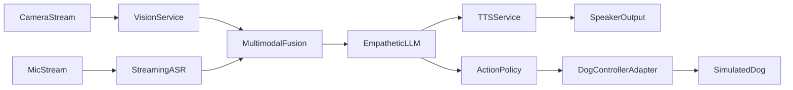

# design

## 概述
本设计围绕机器狗多模态对话 MVP，采用分层模块化架构实现“感知→推理→执行→编排”的实时链路。系统支持 `strict_real` 与 `dev_fallback` 双运行模式；`strict_real` 下对 ASR/TTS/动作链路执行 fail-fast，不允许静默 mock 回退。

## 高层架构（C4 Container）


## 组件职责
| 组件 | 分层 | 职责 |
|---|---|---|
| FaceAnalyzer | perception | 基于 InsightFace + FQA 提取性别、年龄、颜值分（0~10）与置信度 |
| PoseHeightEstimator | perception | 基于 YOLOv8 + MMPose + 标定参数估计身高并输出关键点覆盖度 |
| ASRStream | perception | 将麦克风流转为流式文本片段 |
| PromptBuilder | reasoning | 聚合视觉与语音上下文并注入免责声明 |
| DialogueEngine | reasoning | 基于 Qwen-7B-Chat AWQ 生成回复文本与动作意图，支持 token 流式输出 |
| SafetyGuard | reasoning | 检测风险表达并替换安全话术 |
| TTSEngine | actuation | CosyVoice 文本转语音，支持 `synthesize` 与 `stream_synthesize` |
| DogControllerBase/Mock/Unitree | actuation | 标准化动作控制接口，支持 mock 与 Unitree 真机/仿真执行 |
| EventBus | orchestration | 模块间事件发布订阅与解耦 |
| RealtimeLoop | orchestration | 驱动全双工主循环、并发队列、容错与降级流程 |

## 数据模型（Prisma Schema 占位）
```prisma
model Session {
  id          String   @id @default(cuid())
  startedAt   DateTime @default(now())
  endedAt     DateTime?
  mode        String
  status      String
  turns       Turn[]
}

model Turn {
  id             String   @id @default(cuid())
  sessionId      String
  session        Session  @relation(fields: [sessionId], references: [id])
  createdAt      DateTime @default(now())
  asrText        String?
  visionJson     Json?
  promptText     String?
  replyText      String?
  ttsAudioRef    String?
  actionIntent   String?
  confidenceJson Json?
}
```

## API 契约（OpenAPI 3.1）
```yaml
openapi: 3.1.0
info:
  title: Lucky Dog Multimodal API
  version: 0.1.0
servers:
  - url: http://localhost:8000
paths:
  /health:
    get:
      summary: 服务健康检查
      responses:
        "200":
          description: OK
  /v1/session/start:
    post:
      summary: 创建会话
      responses:
        "200":
          description: 会话已创建
  /v1/session/{sessionId}/turn:
    post:
      summary: 提交一轮多模态输入并返回回复
      parameters:
        - in: path
          name: sessionId
          required: true
          schema:
            type: string
      requestBody:
        required: true
        content:
          application/json:
            schema:
              type: object
              properties:
                asrText:
                  type: string
                vision:
                  type: object
      responses:
        "200":
          description: 返回回复文本、动作意图与免责声明
```

## 错误处理规范
- 统一错误码：
  - `E1000`：参数错误
  - `E2000`：感知模块错误
  - `E3000`：推理模块错误
  - `E4000`：执行模块错误
  - `E5000`：系统内部错误
- 日志规范：
  - 使用结构化 JSON 日志。
  - 必填字段：`timestamp`、`session_id`、`module`、`event`、`latency_ms`、`confidence`、`error_code`。
  - 风险输出必须记录 `safety_intervened` 标记。

## 测试策略
- 单元测试：目标覆盖率 >= 80%，覆盖感知解析、prompt 构造、安全护栏、动作策略。
- 集成测试：覆盖“视频+ASR+LLM+TTS”主链路与模块故障降级。
- E2E 测试：覆盖单人、多人、噪声三类场景，验证连续对话与动作联动。
- 回归策略：每次迭代至少执行核心链路冒烟测试与风险话术回归。
- 视觉专项：验收统计 `vision_detection_rate`、`gender_stability_rate`、`height_jitter_cm`。
